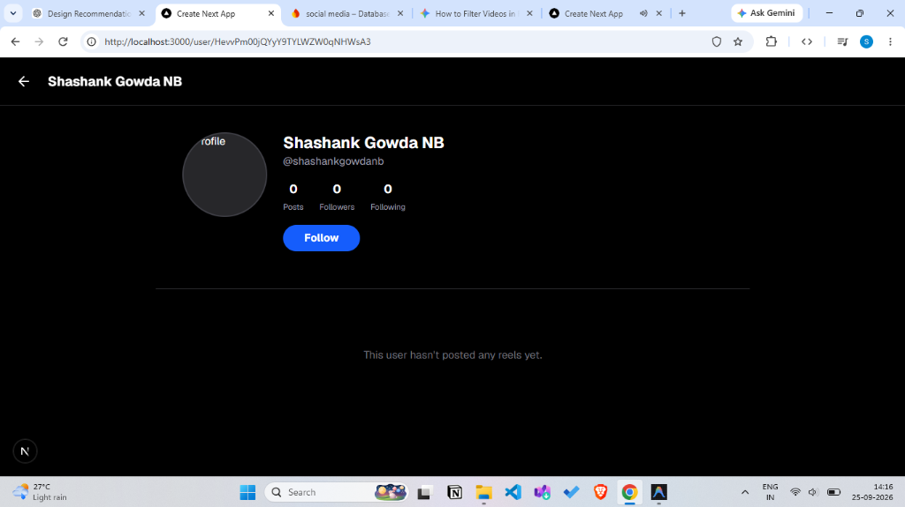

<div align="center">
  
  <h1>ReelX</h1>
  <p><strong>A Premium Short-Form Video Platform with a Personalized Recommendation Engine</strong></p>
</div>

---

## 📖 Overview
ReelX is a production-grade, short-form video platform built with Next.js 16, TypeScript, Firebase, and Cloudinary. It features an advanced, engagement-driven recommendation algorithm that personalizes the feed based on actual user watch behavior, completions, and loops. 

Designed with a mobile-first philosophy, ReelX delivers a seamless, native app-like experience with 100dvh vertical scrolling, glassmorphism UI, and Progressive Web App (PWA) capabilities.

---

## ✨ Core Features
*   **🧠 Personalized Recommendation Engine**: A transparent ranking system that calculates user affinity based on watch-time completion and looping behavior.
*   **📱 Native-Like Vertical Feed**: 100dvh full-screen scrolling with Intersection Observers for lazy loading and efficient memory management.
*   **⚡ High-Performance Media**: Video streaming and dynamic thumbnail generation powered by Cloudinary.
*   **🔒 Secure Authentication**: Firebase Auth integration with protected routes and personalized profiles.
*   **📊 Premium Admin Dashboard**: A glassmorphism control center with infinite scrolling and real-time database insights.
*   **🌍 Progressive Web App (PWA)**: Fully installable as a native APK or desktop application with offline caching capabilities.
*   **🖼️ Graceful Error Handling**: Automated UI-Avatar fallbacks for broken profile images and robust API error boundaries.

---

## 🏗️ Architecture & Data Flow

ReelX is built on a modern, decoupled architecture:
1.  **Frontend (Next.js 16 App Router)**: Server-rendered for SEO and fast initial loads, with highly optimized client components for the interactive video feed.
2.  **State Management (React Hooks)**: Context and custom hooks manage the global feed state, muting, and autoplay logic.
3.  **Database (Firebase Firestore)**: Real-time NoSQL database storing users, videos, and interaction stats (`video_stats`).
4.  **Storage & CDN (Cloudinary)**: Handles raw video uploads, format optimization, and on-the-fly thumbnail generation to reduce bandwidth.

---

## 🧪 The Recommendation Engine

The core of ReelX is its custom recommendation algorithm, centralized in `src/lib/recommendation.config.ts`. It moves beyond simple chronological feeds by implementing a multi-signal scoring system:

### 1. Signals & Candidate Generation
*   **Global Engagement**: Base score calculated from global likes, comments, and shares.
*   **Watch-Time Affinity**: The system tracks the exact percentage of the video watched.
*   **Looping Multipliers**: If a user watches a video more than once, exponential weight is added to that specific content type.

### 2. Personalization & Scoring Formula
`Final Score = (Global Engagement) + (Creator Affinity Bonus) + (Exact Video Loop Bonus)`
*   *Completion Threshold*: Users must watch >80% of a video to trigger an affinity connection with the creator.
*   *Cold Start*: New users without history are served a blend of globally trending content and fresh uploads to bootstrap their affinity profile.

### 3. Diversity & Exploration
To prevent echo chambers, the algorithm enforces a 15% exploration ratio, randomly injecting fresh, undiscovered content into the personalized feed, and applies penalties for recently seen content to prevent infinite loops.

---

## 🚀 Performance Optimizations
*   **Lazy Rendering**: The feed uses `IntersectionObserver` to only mount and play `<video>` elements that are currently in the viewport. Off-screen videos are paused and memory is freed.
*   **Admin Lazy Loading**: The admin panel uses lightweight Cloudinary `` thumbnails instead of raw video tags to prevent browser hanging when loading thousands of records.
*   **Vercel Build Optimization**: Configured to flawlessly deploy on Vercel's strict CI/CD pipeline, bypassing restrictive ESLint rules while maintaining TypeScript safety via explicit type casting.

---

## 🛠️ Technology Stack
*   **Framework**: Next.js 16 (App Router)
*   **Language**: TypeScript
*   **Styling**: Tailwind CSS (Premium Glassmorphism & Custom Gradients)
*   **Database**: Firebase Firestore
*   **Media Storage**: Cloudinary
*   **Icons**: Lucide React
*   **Deployment**: Vercel
*   **PWA**: next-pwa

---

## ⚙️ Local Development

### Prerequisites
*   Node.js 18+
*   npm or yarn
*   Firebase Account
*   Cloudinary Account

### Environment Variables
Create a `.env.local` file in the root directory (do not commit this):
```env
# Cloudinary
CLOUDINARY_CLOUD_NAME=your_cloud_name
CLOUDINARY_API_KEY=your_api_key
CLOUDINARY_API_SECRET=your_api_secret

# Firebase
NEXT_PUBLIC_FIREBASE_API_KEY=your_api_key
NEXT_PUBLIC_FIREBASE_AUTH_DOMAIN=your_auth_domain
NEXT_PUBLIC_FIREBASE_PROJECT_ID=your_project_id
NEXT_PUBLIC_FIREBASE_STORAGE_BUCKET=your_storage_bucket
NEXT_PUBLIC_FIREBASE_MESSAGING_SENDER_ID=your_sender_id
NEXT_PUBLIC_FIREBASE_APP_ID=your_app_id
```

### Installation & Run
```bash
npm install
npm run dev
```

---

## 📈 Future Improvements (Roadmap)
*   **Server-Side Algorithmic Caching**: Moving the affinity calculations to a scheduled Cloud Function to reduce client-side overhead.
*   **Granular Analytics**: Tracking skip rates (swipes within the first 2 seconds) as a negative penalty signal.
*   **Advanced CDN Tiering**: Implementing adaptive bitrate streaming (HLS) for slower network connections.

---
*Built by [MASTER870-CMD]*