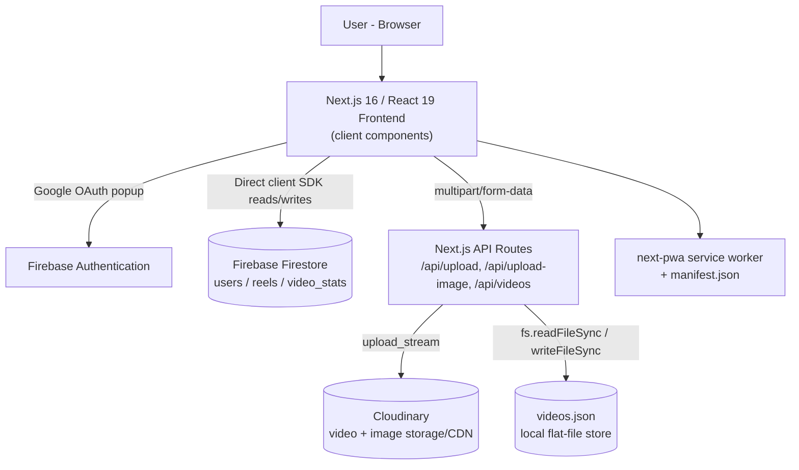

# ReelX

A short-form, vertical-scroll video feed application built with Next.js 16, React 19, and Firebase — featuring a transparent, rule-based feed-ranking algorithm driven by likes, comments, watch-completion, and per-creator affinity.

**Status:** Early-stage / prototype. Core upload, feed, like, comment, and follow flows work end-to-end; several UI elements (share, save) and access controls (admin route, upload API) are not yet functional or secured — see [Known Limitations](#known-limitations).

**Live demo:** https://realx-livid.vercel.app/ (linked from the repository)
**Repository:** https://github.com/MASTER870-CMD/realx


---

## Overview

ReelX is a TikTok/Reels-style vertical video feed. Users sign in with Google, upload short videos (stored on Cloudinary), like/comment/follow other creators, and browse a feed ranked by an engagement-and-personalization scoring formula computed in the browser. There is no machine-learning model or external AI service involved anywhere in the ranking pipeline — the feed logic is explicit, readable JavaScript.

## Key Features

- Google sign-in via Firebase Authentication
- Vertical, swipe/scroll snap-based video feed with autoplay-on-view
- Multi-file video upload (queued, with progress) to Cloudinary
- Profile pages with editable display name and avatar
- Public creator profile pages
- Likes, comments, and follow/unfollow, backed by Firestore
- Per-creator "affinity" scoring built from likes, comments, and watch-completion signals
- Creator search (by display name)
- Admin analytics dashboard (accounts, reels, likes, comments, per-video/per-creator rankings)
- Installable PWA (manifest + service worker via `next-pwa`)

## Recommendation / Feed System

**This is a rule-based ranking system, not a machine-learning recommender.** No model training, embeddings, vector search, or external AI API is used anywhere in the codebase — a code comment in `api/videos/route.ts` explicitly states the current implementation is a heuristic stand-in for a future ML/collaborative-filtering system.

### How the feed works

The active ranking logic (in `src/app/page.tsx`, `fetchVideos()`) computes, for every video in the merged feed:

```
globalEngagement = (likeCount * 2) + (commentCount * 4) + recencyBoost
recencyBoost      = max(0, 10 - ageInDays)
personalBoost     = (currentUser.creatorInteractions[creatorId] || 0) * 5
totalScore        = globalEngagement + personalBoost
```

Videos are sorted descending by `totalScore`. The `personalBoost` term is what makes the feed "personalized": it comes from a per-user Firestore map (`creatorInteractions`) that accumulates points whenever the current user interacts with a given creator's content:

| Action | Creator affinity | Video affinity |
|---|---|---|
| Like a video | +3 | +5 |
| Post a comment | +5 | +10 |
| Watch ≥80% of a video (first time) | +2 | +3 |
| Loop past 200% of duration | +3 (additional) | +5 (additional) |

A second, unused-in-production scoring function also exists at `GET /api/videos`, based on likes, views, keyword count, and recency — its own in-code comment marks it as a mock/demo heuristic. It is superseded by the client-side score above whenever the app renders the feed.

**Not implemented:** categories, trending computed server-side, content-based/collaborative filtering, diversity or exploration/exploitation logic, cold-start handling beyond a zero default, embeddings/vector search, or any external AI API call.

## Architecture



There is no custom backend API layer for the database — Firestore is read and written directly from the browser via the Firebase client SDK. The only server-side logic is the three Next.js API routes handling file uploads and the local JSON video list.

## Technology Stack

| Layer | Technology | Notes |
|---|---|---|
| Framework | Next.js 16.3.5 (App Router) | All routes are client components (`"use client"`) |
| UI | React 19.2.8, Tailwind CSS 4 | |
| Language | TypeScript 5 | Build errors are currently ignored (`ignoreBuildErrors: true`) |
| Auth | Firebase Authentication 12.x | Google provider only |
| Database | Firebase Firestore 12.x | Direct client SDK access, no rules committed |
| Media storage | Cloudinary 2.x | Video + image upload/delivery |
| Local storage fallback | Node `fs` (`videos.json`) | Not suitable for serverless/ephemeral hosting |
| PWA | next-pwa 5.6.0 | Service worker + manifest |
| Icons | lucide-react | |

**Installed but not used anywhere in the source code:** `@supabase/supabase-js`, `framer-motion`, `clsx`, `tailwind-merge`. These should not be described as active technologies until actually wired in.

## Project Structure

```text
realx/
├── src/
│   ├── app/
│   │   ├── page.tsx                # Feed, ranking logic, upload modal, like/comment/follow
│   │   ├── layout.tsx
│   │   ├── globals.css
│   │   ├── admin/page.tsx          # Analytics dashboard (currently unauthenticated)
│   │   ├── profile/page.tsx        # Own profile, avatar upload, reel deletion
│   │   ├── search/page.tsx         # Creator search by display name
│   │   ├── user/[userId]/page.tsx  # Public creator profile
│   │   └── api/
│   │       ├── videos/route.ts
│   │       ├── upload/route.ts
│   │       └── upload-image/route.ts
│   └── lib/
│       ├── firebase.ts
│       └── db.ts                   # Flat-file JSON store helpers
├── data/                            # MicroLens-100K download script (not integrated into the app)
├── public/                          # manifest.json, logo, static assets
├── videos.json                      # Local video metadata store
└── next.config.ts                   # next-pwa config, custom distDir
```

## Data Flow (summary)

- **Auth:** Google popup sign-in → `onAuthStateChanged` → creates/reads a Firestore `users/{uid}` doc.
- **Upload:** File(s) posted via XHR to `/api/upload` → Cloudinary upload → metadata appended to `videos.json` → client separately writes a matching `reels/{id}` doc and an empty `video_stats/{id}` doc to Firestore.
- **Feed:** On load, the client fetches `videos.json` (via `/api/videos`) and Firestore `reels` + `video_stats`, merges/dedupes by id, computes the engagement + affinity score above, and renders paginated results via `IntersectionObserver`.
- **Like/Comment:** Optimistic UI update, then `arrayUnion`/`arrayRemove` on `video_stats`, plus an `increment()` on the current user's `creatorInteractions`/`videoInteractions` maps.
- **Follow:** `arrayUnion`/`arrayRemove` on both the target's `followers` and the current user's `following` fields.
- **Search:** Fetches the entire `users` collection once and filters client-side by display name substring.

## Database / Data Model

Firestore collections actually read/written by the code:

- `users/{uid}`: `displayName`, `photoURL`, `email`, `followers[]`, `following[]`, `creatorInteractions{}`, `videoInteractions{}`
- `reels/{id}`: `title`, `description`, `video_url`, `public_id`, `created_at`, `userId`, `userDisplayName`, `userPhotoURL`
- `video_stats/{id}`: `likes[]` (uids), `comments[]` (`userId`, `displayName`, `photoURL`, `text`, `timestamp`)

Plus a local file, `videos.json`, holding an independent array of upload records that is **not** kept in sync with Firestore (e.g., deleting a reel from the profile page removes the Firestore doc only).

No Firestore/Storage security rules, indexes, or migrations are present in this repository.

## Authentication

Google OAuth via Firebase Authentication only. There is no email/password flow, no server-side session/token verification on API routes, and no role-based access control anywhere (including the `/admin` route).

## Media Pipeline

Videos and profile images are uploaded as `multipart/form-data` to Next.js API routes, streamed into Cloudinary (`resource_type: "video"` / `"image"`), and the resulting `secure_url`/`public_id` are stored. Deleting a reel does not delete its Cloudinary asset.

## UI / UX

Dark, full-bleed vertical video UI with snap-scrolling, autoplay-on-view (via `IntersectionObserver`), a slide-up comments panel, toast notifications, and an admin dashboard with tabbed analytics. Fully responsive via Tailwind CSS. There is no dark/light theme toggle — the interface is hardcoded dark.

## PWA / Mobile Experience

- Installable via `next-pwa` (service worker registered, `skipWaiting: true`, disabled in development)
- `manifest.json` with app name, icons, and portrait `standalone` display
- No custom offline fallback page is defined in the repository

## Security

**Implemented:** Google OAuth login; secrets loaded from environment variables and excluded from git via `.gitignore`.

**Not implemented / not verifiable from this repository — do not assume these are in place:**
- No Firestore/Storage security rules are committed, so database-level authorization cannot be verified
- Upload API routes (`/api/upload`, `/api/upload-image`) have no authentication check
- The `/admin` dashboard has no access control and is reachable by anyone with the URL
- No input validation/sanitization, rate limiting, or abuse prevention
- Uploaded videos are seeded with randomized mock like/view counts, not real metrics

## Performance

**Implemented:** `IntersectionObserver`-based lazy loading/infinite scroll; `preload="metadata"` on videos; Next.js automatic font optimization and route-based code splitting.

**Not implemented:** `next/image` optimization (all images are raw `` tags), request caching/memoization, or server-side pagination of Firestore queries (entire collections are fetched on each load).

Performance benchmarks have not been published.

## Installation

### Requirements
- Node.js (a recent LTS release; not pinned via an `engines` field in `package.json`)
- npm (repository includes `package-lock.json`)
- A Firebase project (Authentication + Firestore enabled)
- A Cloudinary account

### Setup

```bash
git clone https://github.com/MASTER870-CMD/realx.git
cd realx
npm install
```

## Environment Variables

Based on `src/lib/firebase.ts` and the two upload API routes, create a `.env.local` file:

```env
NEXT_PUBLIC_FIREBASE_API_KEY=
NEXT_PUBLIC_FIREBASE_AUTH_DOMAIN=
NEXT_PUBLIC_FIREBASE_PROJECT_ID=
NEXT_PUBLIC_FIREBASE_STORAGE_BUCKET=
NEXT_PUBLIC_FIREBASE_MESSAGING_SENDER_ID=
NEXT_PUBLIC_FIREBASE_APP_ID=

CLOUDINARY_CLOUD_NAME=
CLOUDINARY_API_KEY=
CLOUDINARY_API_SECRET=
```

No `.env` file or real credentials are present in the repository.

## Running Locally

```bash
npm run dev
```

## Production Build

```bash
npm run build
npm run start
```

Note: `next.config.ts` sets a custom `distDir: 'dist'` and disables ESLint/TypeScript build-time error checking.

## Deployment

No `vercel.json`, `Dockerfile`, or other deployment configuration is committed. The repository's GitHub "About" section links to a Vercel-hosted deployment (`https://realx-livid.vercel.app/`), consistent with Next.js's zero-config Vercel support, but no deployment files exist in-repo to confirm the exact configuration used.

Because `lib/db.ts` writes to a local `videos.json` file on disk, this part of the app **will not persist data reliably on serverless/ephemeral hosting** (e.g., Vercel functions do not guarantee a writable, persistent filesystem across invocations).

## Roadmap

**Implemented:** Google auth, video upload/playback, feed with engagement+affinity ranking, likes, comments, follow, profile editing, creator search, admin analytics dashboard, basic PWA support.

**In Progress / Partially Implemented:** share button (UI only), save/bookmark tab (UI only), admin dashboard (functional but unsecured).

**Planned (not implemented):**
- Firestore/Storage security rules
- Server-side authentication checks on API routes and admin access control
- Real content/video search and categories
- Notifications
- Content moderation/reporting tools
- Improved feed personalization: cold-start handling, content diversity, exploration/exploitation, offline evaluation of ranking quality
- A real recommendation pipeline (the included MicroLens-100K dataset download script in `data/` suggests this direction was being explored but is not yet integrated into the app)

## Known Limitations

- Dual, unsynchronized video storage (`videos.json` local file + Firestore `reels`)
- No database security rules committed
- `/admin` and upload endpoints have no access control
- Share/save features are visual only
- No real-time (`onSnapshot`) updates — all reads are one-time fetches
- Full-collection Firestore reads will not scale with data volume

## Future Improvements

See Roadmap above — particularly database security rules, API-route authentication, and a genuine feed-ranking improvement path (diversity, exploration, cold-start handling) before any ML-based personalization is introduced.

## Contributing

No `CONTRIBUTING.md` currently exists. Open an issue or pull request on the [GitHub repository](https://github.com/MASTER870-CMD/realx).

## License

No `LICENSE` file is currently included in this repository. Until one is added, all rights are reserved by default.

## Author

[MASTER870-CMD](https://github.com/MASTER870-CMD)
